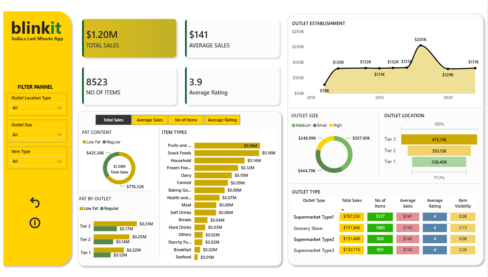

# 🛒 Blinkit Sales Analysis Dashboard | Power BI

An interactive dashboard created in **Microsoft Power BI** to analyze Blinkit sales data and compare sales across products, outlets, and locations.

## 📊 Dashboard Preview

## 📌 Project Overview

This project uses Blinkit sales data to build an interactive dashboard for understanding overall sales performance and outlet-wise trends.

The dashboard includes:

* Overall sales performance
* Sales by outlet type and location
* Item type and fat content analysis
* Outlet size analysis
* Customer ratings
* Outlet establishment trends

Slicers and filters allow the data to be explored by different categories.

## 🎯 Project Objectives

* Analyze overall sales performance
* Compare sales across outlet types and locations
* Analyze product categories and fat content
* Compare different outlet sizes
* Track sales across outlet establishment years

## 📈 Key KPIs

| KPI                 |      Value |
| ------------------- | ---------: |
| **Total Sales**     | **$1.20M** |
| **Average Sales**   |   **$141** |
| **Number of Items** |  **8,523** |
| **Average Rating**  |    **3.9** |

## 📊 Dashboard Features

### 💰 Sales

* Total Sales
* Average Sales
* Sales by Outlet Type
* Sales by Outlet Location
* Sales by Outlet Size

### 🛍️ Products

* Sales by Item Type
* Fat Content Analysis
* Number of Items
* Item Visibility

### 🏪 Outlets

* Outlet Establishment Trend
* Outlet Location Analysis
* Outlet Size Analysis
* Outlet Type Comparison

### 🎛️ Interactive Controls

* Dynamic slicers and filters
* Reset Filter button
* Interactive information button

## 🗂️ Dataset

The dataset contains product, sales, and outlet information, including:

* Item Type
* Item Fat Content
* Item Weight
* Item Visibility
* Outlet Establishment Year
* Outlet Location Type
* Outlet Size
* Outlet Type
* Sales
* Customer Rating

## 🛠️ Tools & Technologies

* **Power BI** — Dashboard and visualizations
* **Power Query** — Data cleaning and transformation
* **DAX** — Measures and calculations
* **Excel** — Dataset

## 🔍 Key Insights

The dashboard helps compare:

* Sales across different outlet types
* Sales across outlet locations
* Performance of different product categories
* Sales by outlet size
* Sales based on fat content
* Sales across outlet establishment years

## 🚀 How to View

1. Download the `.pbix` file from this repository.
2. Open it in **Microsoft Power BI Desktop**.
3. Use the slicers and visuals to explore the dashboard.

## 👩‍💻 Author

**Dhatri Tripathi**

B.Tech CSE | Data Analytics Enthusiast
